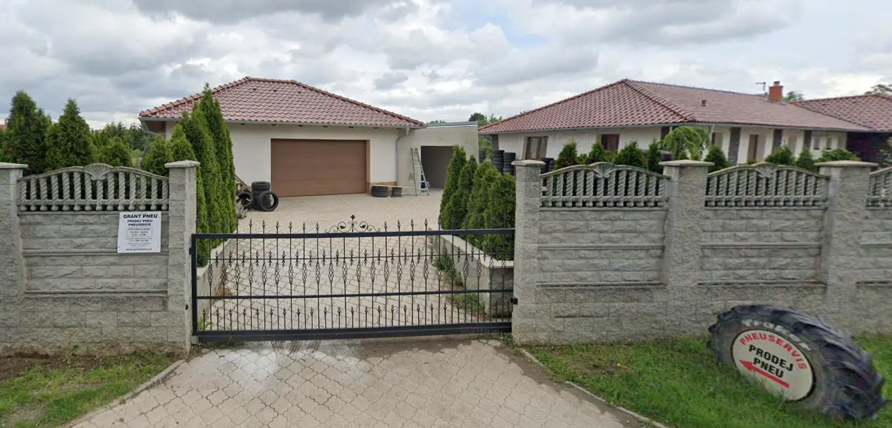

# GrandPneu - Professional Tire Service Website

A modern, responsive website for a tire service company located in Pravlov, Czech Republic. The website features a clean design with dark/light mode support and smooth animations.



## Features

- 🌓 Dark/Light mode toggle
- 📱 Fully responsive design
- 🎯 Smooth scroll animations
- 🔄 Interactive service cards
- 📝 Contact form
- 🗺️ Google Maps integration
- 🎨 Modern UI with CSS animations
- 💻 Cross-browser compatibility

## Technologies Used

- HTML5
- CSS3
- JavaScript (ES6+)
- PHP
- Bootstrap Icons
- Google Fonts
- Google Maps Embed API

## Project Structure

## Setup and Installation

1. Clone the repository:
```bash
git clone https://github.com/Pavel-Kadanka/grandpneu.git
```

2. Set up a local PHP server or deploy to your hosting provider

3. Ensure all image assets are properly placed in the `public/` directory

4. Update the Google Maps embed API key in `index.php` if necessary

## Features in Detail

### Theme Toggle
- Supports both dark and light modes
- Persists user preference using localStorage
- Smooth transition animations

### Responsive Navigation
- Desktop menu with smooth scroll
- Mobile-friendly hamburger menu
- Animated menu transitions

### Service Section
- Expandable service cards
- Interactive hover effects
- Detailed service information

### Pricing Section
- Clear pricing structure
- Responsive grid layout
- Special offers highlight

### Contact Section
- Interactive contact form
- Google Maps integration
- Business hours display
- Complete contact information

## Browser Support

- Chrome (latest)
- Firefox (latest)
- Safari (latest)
- Edge (latest)

## Performance Optimization

- Webp image format for optimal loading
- Lazy loading for images
- Minified CSS and JavaScript
- Optimized Google Fonts loading

## SEO Features

- Semantic HTML structure
- Meta tags optimization
- Schema.org markup
- Open Graph tags
- Canonical URLs

## License

All rights reserved. Unauthorized copying, distribution, or modification of this project is strictly prohibited.

© 2025 Pavel Kadanka. All Rights Reserved.

## Author

Pavel Kadaňka - [Portfolio](https://kadanka.vercel.app)

## Acknowledgments

- Bootstrap Icons for the icon set
- Google Fonts for typography
- All images are property of GrandPneu
